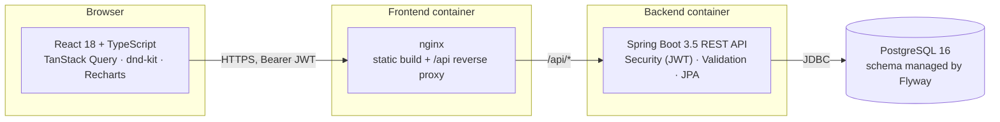

# ApplyTrack

**A full-stack job-application tracker: drag applications across a Kanban board, keep an automatic timeline of every status change, log interviews, and see how your search is going.**

Built with **React + TypeScript** on the front end and **Spring Boot 3 (Java 21)** on the back end, with JWT authentication, Flyway migrations, and tests on both sides.


| Stats dashboard | Detail drawer with timeline and interviews |
| --- | --- |
|  |  |

| Table view with search and filters | Mobile (390 px) |
| --- | --- |
|  |  |

> The screenshots show the seeded demo account. All companies in it are fictional.

## Features

- **Accounts:** register and log in. Passwords are hashed with BCrypt and the API uses stateless JWT bearer tokens. Each user can only see and change their own data. Another user's IDs return `404`, so the API doesn't even reveal that they exist.
- **Kanban board:** six columns (Wishlist, Applied, Interview, Offer, Rejected, Ghosted). Cards move with drag-and-drop (`@dnd-kit`, with mouse, touch and keyboard support). The move shows up at once and is rolled back if the server rejects it.
- **Automatic timeline:** every status change is saved as a `StatusChange` row, and the detail drawer shows the full history. Moving a card out of Wishlist fills in the applied date if it was empty.
- **Interviews:** each application can have interviews (date and time, type, notes). Upcoming ones are highlighted.
- **Table view:** free-text search (company, role or location), status filter chips, a tag filter, sortable columns and server-side pagination.
- **Dashboard:** counts per status, response rate and interview rate (worked out from the timeline, not only the current status), applications per week for the last 12 weeks, upcoming interviews and follow-ups.
- **Follow-ups page:** overdue and upcoming follow-ups for active applications, plus scheduled interviews.
- **Clean API errors:** every error is an RFC 9457 `ProblemDetail`. Validation errors also include a `field -> message` map, which the forms show next to the matching inputs.
- **Responsive:** a sidebar on wide screens, an icon rail on laptops so all six columns fit, and a top bar with bottom navigation on phones. It was checked at 390 px with no horizontal page scroll.
- **OpenAPI:** Swagger UI at `/swagger-ui.html` in development.

## Architecture



In development, Vite serves the UI on `:5181` and proxies `/api` to Spring Boot on `:8081`. Spring Boot runs on an in-memory H2 database in PostgreSQL mode, so no Docker is needed.

Backend layout (by feature, not by layer):

```
dev.hamza.applytrack
├── auth/          AuthController, AuthService, JwtService, JwtAuthenticationFilter
├── application/   JobApplication (aggregate root), StatusChange, Interview,
│                  repositories, JPA Specifications for filtering, service, controller
├── stats/         StatsService (aggregate queries + weekly buckets), StatsController
├── user/          User entity + repository
├── config/        SecurityConfig (stateless, CORS, ProblemDetail 401/403), OpenAPI, Clock
├── common/        GlobalExceptionHandler + domain exceptions
└── seed/          DemoDataSeeder (dev profile only)
```

A few design choices:

- **`JobApplication` owns its timeline.** Status changes go through `JobApplication.moveTo(...)`, which appends the `StatusChange` itself. The history can't get out of sync with the current status, whichever endpoint (PUT, PATCH, or a Kanban drop) changed it.
- **Owner scoping lives in the repository.** Every lookup is `findByIdAndOwnerId`, and every list query starts from an `ownedBy(ownerId)` Specification.
- **An injectable `Clock`** makes date logic (timelines, weekly buckets, overdue follow-ups, token expiry) testable with fixed dates.
- **The principal is rebuilt from the JWT** (`AuthUser(id, email)`) without a database lookup on each request.

## Tech stack

| Layer | Tools |
| --- | --- |
| Frontend | React 18, TypeScript 5.9, Vite 7, React Router 6, TanStack Query 5, @dnd-kit/core, Recharts 3, lucide-react, plain CSS with design tokens |
| Backend | Java 21, Spring Boot 3.5 (Web, Data JPA, Validation, Security, Actuator), jjwt 0.12, springdoc-openapi 2.8, Flyway |
| Database | PostgreSQL 16 (prod), H2 in PostgreSQL mode (dev and tests) |
| Testing | JUnit 5, Spring MockMvc, `@DataJpaTest`, AssertJ, Vitest, Testing Library |
| Infra | Docker (multi-stage builds), docker compose, nginx, GitHub Actions |

## Running locally (no Docker needed)

Prerequisites: **JDK 21+** and **Node 22+**. Maven is not needed because the project ships the Maven wrapper.

```bash
# 1) API on http://localhost:8081 (dev profile: in-memory H2 + demo data)
cd backend
./mvnw spring-boot:run          # Windows: mvnw.cmd spring-boot:run

# 2) UI on http://localhost:5181 (proxies /api to :8081)
cd frontend
npm install
npm run dev
```

Then open http://localhost:5181 and click **"Explore with the demo account"**, or sign in with:

| Email | Password |
| --- | --- |
| `demo@applytrack.dev` | `demo1234` |

The demo data is recreated on every start, and its dates are relative to today. API docs are at http://localhost:8081/swagger-ui.html.

## Running the full stack with Docker Compose

```bash
cp .env.example .env            # then set JWT_SECRET, e.g. openssl rand -base64 48
docker compose up --build
# open http://localhost:8080
```

This starts PostgreSQL 16, the API (`prod` profile, configured by environment variables) and the built UI behind nginx, which proxies `/api` to the backend.

> **Note:** the Dockerfiles and `docker-compose.yml` were written carefully but **have not been run yet**, because Docker wasn't available on the machine this was built on. The dev setup above and the CI pipeline are what's been verified.

### Configuration (prod profile)

| Variable | Purpose |
| --- | --- |
| `DATABASE_URL`, `DATABASE_USERNAME`, `DATABASE_PASSWORD` | PostgreSQL connection |
| `JWT_SECRET` | Base64 HMAC key, at least 256 bits (required; the app refuses to start without it) |
| `CORS_ALLOWED_ORIGINS` | Comma-separated origins, if the UI is served from another origin |
| `SEED_DEMO_DATA` | `true` to create the demo account on first start |
| `SWAGGER_ENABLED` | `true` to expose the OpenAPI docs in prod |

## API overview

All endpoints except register and login need `Authorization: Bearer <token>`. Errors come back as `application/problem+json`.

| Method | Path | Description |
| --- | --- | --- |
| POST | `/api/auth/register` | Create an account and get a token |
| POST | `/api/auth/login` | Log in and get a token |
| GET | `/api/auth/me` | Current user |
| GET | `/api/applications` | List applications. Query params: `status` (repeatable), `q`, `tag`, `page`, `size` (max 200), `sort=field,dir` |
| POST | `/api/applications` | Create an application (writes the first timeline entry) |
| GET | `/api/applications/{id}` | Detail with timeline and interviews |
| PUT | `/api/applications/{id}` | Update an application |
| PATCH | `/api/applications/{id}/status` | Change status (adds a timeline entry) |
| DELETE | `/api/applications/{id}` | Delete an application |
| POST | `/api/applications/{id}/interviews` | Add an interview |
| DELETE | `/api/applications/{id}/interviews/{interviewId}` | Remove an interview |
| GET | `/api/applications/tags` | The current user's distinct tags |
| GET | `/api/stats` | Counts per status, response and interview rate, applications per week, upcoming follow-ups and interviews |

Example validation error:

```json
{
  "type": "about:blank",
  "title": "Validation failed",
  "status": 400,
  "detail": "One or more fields are invalid",
  "instance": "/api/auth/register",
  "errors": {
    "email": "must be a well-formed email address",
    "password": "must be between 8 and 72 characters"
  }
}
```

## Testing

```bash
cd backend  && ./mvnw test            # 37 tests
cd frontend && npm test               # 16 tests
cd frontend && npm run build          # type-check + production build
```

**Backend (JUnit 5, runs on H2 with the real Flyway migrations):**

- `AuthFlowIntegrationTest`: register, login (email is case-insensitive), wrong password returns 401, duplicate email returns 409, field-level validation errors, missing or tampered token returns 401.
- `JobApplicationApiIntegrationTest`: CRUD, `Location` header, tag normalisation, timeline entries (including no-op moves), status/text/tag filters with paging, rejection of unknown sort fields, interviews.
- `OwnershipIsolationIntegrationTest`: a second user can't read, update, change the status of, delete, or add interviews to another user's application, and doesn't see it in lists, tags or stats.
- `StatsApiIntegrationTest` and `StatsServiceTest`: status counts, response rate taken from the timeline, 12 zero-filled Monday-based weeks (fixed `Clock`), overdue and upcoming follow-ups.
- `JobApplicationServiceTest` (`@DataJpaTest`): timeline ordering, the applied date being filled in automatically, owner scoping, the tag filter not duplicating rows, and LIKE wildcards being escaped.
- `JwtServiceTest`: token round-trip, expiry, wrong key, garbage input, and fail-fast on a missing secret.

**Frontend (Vitest + Testing Library):** the typed API client (auth header, anonymous calls, problem-detail parsing, 401 handling, 204), the board helpers used for optimistic updates, date helpers, and the Kanban board component (columns, counts, click to open).

CI (`.github/workflows/ci.yml`) runs `./mvnw -B test` on JDK 21 and `npm ci && npm test && npm run build` on Node 22 for every push and pull request.

## Project structure

```
applytrack/
├── backend/                      Spring Boot API (Maven wrapper included)
│   ├── src/main/java/dev/hamza/applytrack/...
│   ├── src/main/resources/
│   │   ├── application*.properties   default / dev (H2 + seed) / prod (PostgreSQL)
│   │   └── db/migration/V1__init_schema.sql
│   ├── src/test/java/...         integration, repository and unit tests
│   └── Dockerfile
├── frontend/                     React + TypeScript (Vite)
│   ├── src/api/                  typed client, endpoints, DTO types
│   ├── src/auth/                 AuthProvider (token storage, auto-logout on expiry / 401)
│   ├── src/components/           KanbanBoard, ApplicationDrawer, ApplicationForm, layout...
│   ├── src/hooks/                TanStack Query hooks (optimistic status change), URL-driven panels
│   ├── src/pages/                Board, List, Dashboard, Follow-ups, Login/Register
│   ├── src/lib/                  status metadata, date and board helpers
│   ├── nginx.conf
│   └── Dockerfile
├── docs/screenshots/
├── docker-compose.yml
└── .github/workflows/ci.yml
```

## Possible next steps

- Email or calendar reminders for follow-ups
- Import from a CSV or a job board link
- Refresh tokens stored in httpOnly cookies instead of `localStorage`
- A Testcontainers-based PostgreSQL test profile

## Author

Hamza Ben Ismail ([@naniiic137](https://github.com/naniiic137))

## License

© 2026 Hamza Ben Ismail. All rights reserved.
