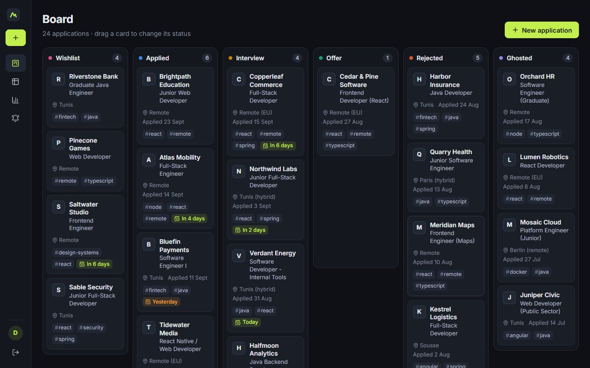
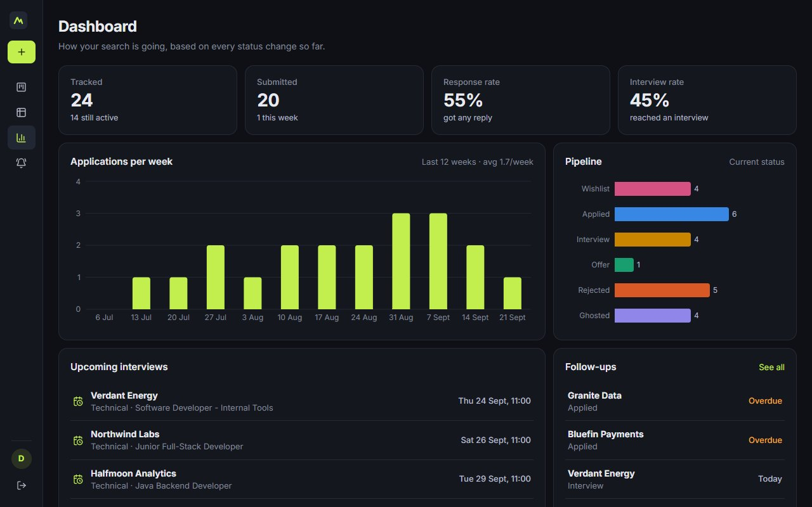
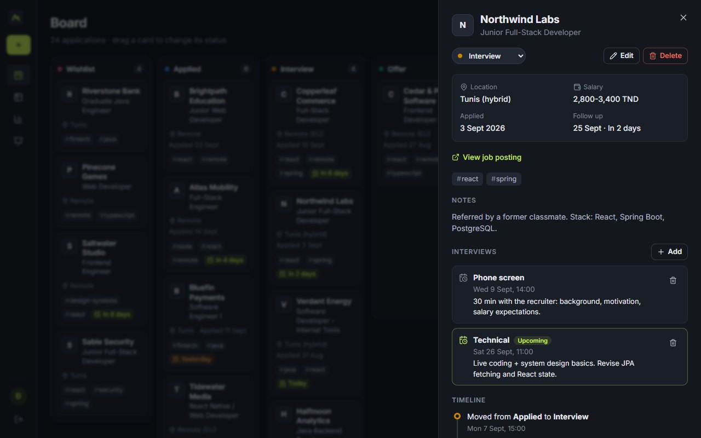
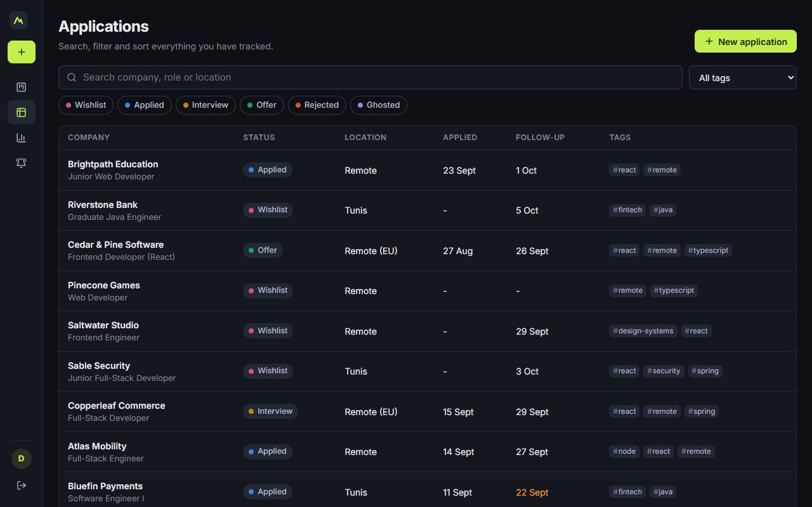
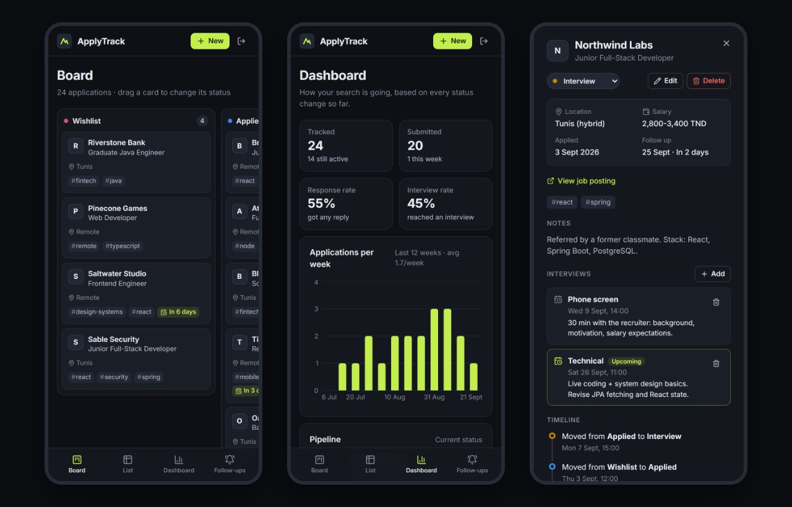
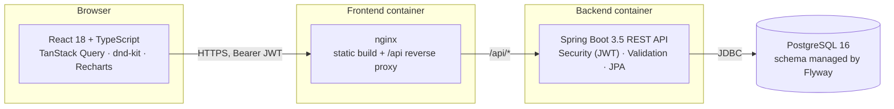

# ApplyTrack

[](https://github.com/naniiic137/applytrack/actions/workflows/ci.yml)

**A full-stack job-application tracker: drag applications across a Kanban board, keep an automatic timeline of every status change, log interviews, and see how your search is going.**

Built with **React + TypeScript** on the front end and **Spring Boot 3 (Java 21)** on the back end, with JWT authentication, Flyway migrations, and tests on both sides.



| Stats dashboard | Detail drawer with timeline and interviews |
| --- | --- |
|  |  |

| Table view with search and filters | Mobile (390 px) |
| --- | --- |
|  |  |

> The screenshots show the seeded demo account. All companies in it are fictional.

## Features

- **Accounts:** register and log in. Passwords are hashed with BCrypt and the API uses stateless JWT bearer tokens. Each user can only see and change their own data. Another user's IDs return `404`, so the API doesn't even reveal that they exist. Failed logins are rate limited (see [Security notes](#security-notes)).
- **Kanban board:** six columns (Wishlist, Applied, Interview, Offer, Rejected, Ghosted). Cards move with drag-and-drop (`@dnd-kit`, with mouse, touch and keyboard support) or with a **Move to** menu on each card. The move shows up at once and is rolled back if the server rejects it. Screen readers hear the company and role of the card being moved.
- **No lost edits:** applications carry a version number (optimistic locking). If the same application was changed in another tab or on another device, the save is refused with `409` and the UI says it refreshed the data, instead of silently overwriting.
- **Automatic timeline:** every status change is saved as a `StatusChange` row, and the detail drawer shows the full history. Moving a card out of Wishlist fills in the applied date if it was empty.
- **Interviews:** each application can have interviews (date and time, type, notes). Upcoming ones are highlighted.
- **Table view:** free-text search (company, role or location), status filter chips, a tag filter, sortable columns and server-side pagination.
- **Dashboard:** counts per status, response rate and interview rate, applications per week for the last 12 weeks, upcoming interviews and follow-ups. Rates are worked out from the timeline of submitted applications (current status not Wishlist), so they never go above 100%. A move undone within 24 hours (back to the status it came from) counts as a mis-drag, not as a reply from the company.
- **Your time zone:** the browser sends its IANA time zone (`X-Time-Zone: Africa/Tunis`), so "today" (default applied date, overdue follow-ups, weekly chart) is your day, not the server's UTC day.
- **Follow-ups page:** overdue and upcoming follow-ups for active applications, plus scheduled interviews.
- **Clean API errors:** every error is an RFC 9457 `ProblemDetail`. Validation errors also include a `field -> message` map, which the forms show next to the matching inputs.
- **Accessible dialogs:** focus stays inside the open dialog or drawer (the rest of the page is `inert`), Escape closes it and focus goes back where it was.
- **Responsive:** a sidebar on wide screens, an icon rail on laptops so all six columns fit, and a top bar with bottom navigation on phones. It was checked at 390 px with no horizontal page scroll.
- **OpenAPI:** Swagger UI at `/swagger-ui.html` in development.

## Architecture



In development, Vite serves the UI on `:5181` and proxies `/api` to Spring Boot on `:8081`. Spring Boot runs on an in-memory H2 database in PostgreSQL mode, so no Docker is needed.

Backend layout (by feature, not by layer):

```
dev.hamza.applytrack
├── auth/          AuthController, AuthService, JwtService, JwtAuthenticationFilter
├── application/   JobApplication (aggregate root), StatusChange, Interview,
│                  repositories, JPA Specifications for filtering, service, controller
├── stats/         StatsService (aggregate queries + weekly buckets), StatsController
├── user/          User entity + repository
├── config/        SecurityConfig (stateless, CORS, ProblemDetail 401/403), OpenAPI, Clock
├── common/        GlobalExceptionHandler + domain exceptions
└── seed/          DemoDataSeeder (dev profile only)
```

A few design choices:

- **`JobApplication` owns its timeline.** Status changes go through `JobApplication.moveTo(...)`, which appends the `StatusChange` itself. The history can't get out of sync with the current status, whichever endpoint (PUT, PATCH, or a Kanban drop) changed it.
- **Owner scoping lives in the repository.** Every lookup is `findByIdAndOwnerId`, and every list query starts from an `ownedBy(ownerId)` Specification.
- **An injectable `Clock`** makes date logic (timelines, weekly buckets, overdue follow-ups, token expiry, rate-limit windows) testable with fixed dates, including the minutes around midnight in `Africa/Tunis`.
- **Optimistic locking with the client's version.** JPA's `@Version` alone only protects the milliseconds between the server's own read and write. The client also sends back the version it displayed, so an edit made from a tab opened ten minutes ago is caught too.
- **The principal is rebuilt from the JWT** (`AuthUser(id, email)`) without a database lookup on each request.

## Tech stack

| Layer | Tools |
| --- | --- |
| Frontend | React 18, TypeScript 5.9, Vite 7, React Router 6, TanStack Query 5, @dnd-kit/core, Recharts 3, lucide-react, plain CSS with design tokens |
| Backend | Java 21, Spring Boot 3.5 (Web, Data JPA, Validation, Security, Actuator), jjwt 0.12, springdoc-openapi 2.8, Flyway |
| Database | PostgreSQL 16 (prod), H2 in PostgreSQL mode (dev and tests) |
| Testing | JUnit 5, Spring MockMvc, `@DataJpaTest`, AssertJ, Mockito, Testcontainers (PostgreSQL), JaCoCo, Vitest, Testing Library |
| Infra | Docker (multi-stage builds), docker compose, nginx, GitHub Actions |

## Running locally (no Docker needed)

Prerequisites: **JDK 21+** and **Node 22+**. Maven is not needed because the project ships the Maven wrapper.

```bash
# 1) API on http://localhost:8081 (dev profile: in-memory H2 + demo data)
cd backend
./mvnw spring-boot:run          # Windows: mvnw.cmd spring-boot:run

# 2) UI on http://localhost:5181 (proxies /api to :8081)
cd frontend
npm install
npm run dev
```

Then open http://localhost:5181 and click **"Explore with the demo account"**, or sign in with:

| Email | Password |
| --- | --- |
| `demo@applytrack.dev` | `demo1234` |

The demo data is recreated on every start (in-memory database), and its dates are relative to today. API docs are at http://localhost:8081/swagger-ui.html.

## Running the full stack with Docker Compose

```bash
cp .env.example .env
# JWT_SECRET is empty on purpose: compose refuses to start until you set it
echo "JWT_SECRET=$(openssl rand -base64 48)" >> .env      # or paste it into .env
# optional: SEED_DEMO_DATA=true in .env to get the demo account
docker compose up --build -d --wait
# open http://localhost:8080
bash scripts/smoke-test.sh      # optional end-to-end check (needs curl + jq)
docker compose down -v          # stop and delete the database volume
```

This starts PostgreSQL 16, the API (`prod` profile, configured by environment variables) and the built UI behind nginx, which proxies `/api` to the backend and adds the security headers. The API refuses to start if `JWT_SECRET` is missing, is not valid Base64 or is shorter than 256 bits, and the error message says how to generate one.

The stack is exercised on every push: the `docker` CI job builds both images, starts the stack with `docker compose up --wait` and runs [`scripts/smoke-test.sh`](scripts/smoke-test.sh) through nginx (health, security headers, register, login, `/me`, create, status move, stale-version `409`, stats).

### Configuration (prod profile)

| Variable | Purpose |
| --- | --- |
| `DATABASE_URL`, `DATABASE_USERNAME`, `DATABASE_PASSWORD` | PostgreSQL connection |
| `JWT_SECRET` | Base64 HMAC key, at least 256 bits, e.g. `openssl rand -base64 48` (required; the app refuses to start without a valid one) |
| `CORS_ALLOWED_ORIGINS` | Comma-separated origins, if the UI is served from another origin |
| `SEED_DEMO_DATA` | `true` to create the demo account on first start (default `false`; only the dev profile seeds by default) |
| `SWAGGER_ENABLED` | `true` to expose the OpenAPI docs in prod |

## API overview

All endpoints except register and login need `Authorization: Bearer <token>`. Errors come back as `application/problem+json`; unexpected errors are logged and returned as a generic `500` without internals. Clients may send `X-Time-Zone: <IANA id>` (defaults to UTC).

| Method | Path | Description |
| --- | --- | --- |
| POST | `/api/auth/register` | Create an account and get a token |
| POST | `/api/auth/login` | Log in and get a token (`429` + `Retry-After` after too many failures) |
| GET | `/api/auth/me` | Current user |
| GET | `/api/applications` | List applications. Query params: `status` (repeatable), `q`, `tag`, `page`, `size` (max 200), `sort=field,dir` |
| POST | `/api/applications` | Create an application (writes the first timeline entry) |
| GET | `/api/applications/{id}` | Detail with timeline and interviews |
| PUT | `/api/applications/{id}` | Update an application. The body carries the `version` last read (`409` if stale) |
| PATCH | `/api/applications/{id}/status` | Change status (adds a timeline entry). Body: `{"status": "...", "version": n}` |
| DELETE | `/api/applications/{id}` | Delete an application |
| POST | `/api/applications/{id}/interviews` | Add an interview |
| DELETE | `/api/applications/{id}/interviews/{interviewId}` | Remove an interview |
| GET | `/api/applications/tags` | The current user's distinct tags |
| GET | `/api/stats` | Counts per status, response and interview rate, applications per week, upcoming follow-ups and interviews |

Example validation error:

```json
{
  "type": "about:blank",
  "title": "Validation failed",
  "status": 400,
  "detail": "One or more fields are invalid",
  "instance": "/api/auth/register",
  "errors": {
    "email": "must be a well-formed email address",
    "password": "must be between 8 and 72 characters"
  }
}
```

## Testing

```bash
cd backend  && ./mvnw test            # 67 tests (2 of them need Docker, see below) + JaCoCo report
cd frontend && npm test               # 31 tests
cd frontend && npm run build          # type-check + production build
```

**Backend (JUnit 5, 67 tests).** 65 run on H2 in PostgreSQL mode with the real Flyway migrations, so a local run needs no Docker. `PostgresIntegrationTest` runs the main flow again on a real PostgreSQL 16 with Testcontainers; it is skipped when Docker isn't available and always runs in CI. Line coverage is about 86% (JaCoCo, `backend/target/site/jacoco/index.html`).

- `AuthFlowIntegrationTest`: register, login (email is case-insensitive), wrong password returns 401, duplicate email returns 409, field-level validation errors, the password limit counted in UTF-8 bytes (40 x "é" is rejected with a clear message instead of a 500), missing or tampered token returns 401.
- `LoginRateLimitIntegrationTest` and `LoginAttemptLimiterTest`: an account locked after 5 failures even for the right password (`429` + `Retry-After`), one IP trying many accounts, the sliding window, a success clearing the failures, identical answers for unknown email and wrong password.
- `AuthServiceTest`: the dummy BCrypt check for unknown emails (timing), a registration losing the race on the unique email returns 409.
- `JobApplicationApiIntegrationTest`: CRUD, `Location` header, tag normalisation, timeline entries (including no-op moves), stale and missing versions, follow-up before the auto-filled applied date, unknown time zones, status/text/tag filters with paging, rejection of unknown sort fields, interviews.
- `OwnershipIsolationIntegrationTest`: a second user can't read, update, change the status of, delete, or add interviews to another user's application, and doesn't see it in lists, tags or stats.
- `StatsApiIntegrationTest` and `StatsServiceTest`: status counts, rates never above 100% (applications moved back to Wishlist, mis-drags undone within 24 hours, quick real progressions), 12 zero-filled Monday-based weeks, overdue follow-ups and week boundaries at 23:30 UTC seen from `Africa/Tunis`.
- `JobApplicationServiceTest` (`@DataJpaTest`): timeline ordering, the applied date filled in from the user's calendar day, optimistic locking, owner scoping, the tag filter not duplicating rows, and LIKE wildcards being escaped.
- `JwtServiceTest`: token round-trip, expiry, wrong key, garbage input, and fail-fast on a missing, non-Base64 or too-short secret.
- `GlobalExceptionHandlerTest`, `MaxUtf8BytesValidatorTest`, `ClientTimeZoneTest`: generic 500 without internals, constraint violations as 409, byte counting, time-zone fallback.

**Frontend (Vitest + Testing Library, 31 tests):** the typed API client (auth and time-zone headers, anonymous calls, problem-detail parsing, 401 handling, 204), the status-change hook (sends the version, stores the new one, rolls back on a stale-version 409), the friendly "updated elsewhere" message, the board helpers, date helpers, the Kanban board (columns, counts, click to open, keyboard **Move to** menu, drag announcements by company and role), the modal (focus trap, `inert` background, stable focus across re-renders), logout in one tab logging out the others, and the board notice when there are more than 200 applications.

CI (`.github/workflows/ci.yml`) runs three jobs on every push and pull request: `./mvnw -B test` on JDK 21 (with the PostgreSQL tests and a coverage summary), `npm ci && npm test && npm run build` on Node 22, and the Docker Compose smoke test described above.

## Security notes

- **Passwords:** BCrypt. The length limit is 72 **bytes** (what BCrypt actually hashes), checked with a custom `@MaxUtf8Bytes` constraint, so accented or emoji passwords get a clear validation message instead of a server error.
- **Login throttling:** failed logins are limited per account (5) and per client IP (20) in a 15-minute sliding window; after that the API answers `429` with `Retry-After`. Successful logins clear the account's failures. The counters are in memory, which fits a single instance; several instances would need a shared store or a limit at the proxy.
- **No user enumeration at login:** an unknown email and a wrong password get the same `401`, and an unknown email is still compared against a dummy BCrypt hash so the response time is the same. (Registration still says when an email is taken, as most sign-up forms do.)
- **Client IP behind nginx:** nginx overwrites `X-Forwarded-For` with the real client address and the prod profile only trusts it from private-network proxies, so the per-IP limit can't be bypassed with a forged header.
- **Security headers (nginx):** Content-Security-Policy (`script-src 'self'`, `connect-src 'self'`, `frame-ancestors 'none'`), `X-Content-Type-Options: nosniff`, `Referrer-Policy`, `X-Frame-Options`, `Permissions-Policy`. Styles allow `'unsafe-inline'` because React and Recharts set style attributes at runtime, and Google Fonts is allowed for the Inter font.
- **Tokens:** JWTs are kept in `localStorage` and cleared in every open tab when you log out in one of them (`storage` event). With a strict CSP this is a reasonable trade-off for a portfolio project; httpOnly refresh cookies are listed below as a next step.
- **Errors:** unexpected exceptions are logged server-side and returned as a generic `500` problem detail; database constraint races (such as two sign-ups with the same email) become `409`.
- **Demo data:** off by default in the `prod` profile and in `docker-compose.yml`; only the local dev profile seeds the demo account.

## Project structure

```
applytrack/
├── backend/                      Spring Boot API (Maven wrapper included)
│   ├── src/main/java/dev/hamza/applytrack/...
│   ├── src/main/resources/
│   │   ├── application*.properties   default / dev (H2 + seed) / prod (PostgreSQL)
│   │   └── db/migration/        V1 schema, V2 optimistic-lock version column
│   ├── src/test/java/...         integration, repository, unit and Testcontainers tests
│   └── Dockerfile
├── frontend/                     React + TypeScript (Vite)
│   ├── src/api/                  typed client, endpoints, DTO types
│   ├── src/auth/                 AuthProvider (token storage, auto-logout on expiry / 401)
│   ├── src/components/           KanbanBoard, ApplicationDrawer, ApplicationForm, layout...
│   ├── src/hooks/                TanStack Query hooks (optimistic status change), URL-driven panels
│   ├── src/pages/                Board, List, Dashboard, Follow-ups (lazy-loaded), Login/Register
│   ├── src/lib/                  status metadata, date and board helpers
│   ├── nginx.conf, security-headers.conf
│   └── Dockerfile
├── scripts/smoke-test.sh         end-to-end check of the running Docker stack (used in CI)
├── docs/screenshots/
├── docker-compose.yml
└── .github/workflows/ci.yml
```

## Possible next steps

- Email or calendar reminders for follow-ups
- Import from a CSV or a job board link
- Refresh tokens stored in httpOnly cookies instead of `localStorage`
- A shared (Redis) store for the login rate limit if the API ever runs on several instances
- Paging or virtual scrolling on the board for searches with more than 200 applications

## Author

Hamza Ben Ismail ([@naniiic137](https://github.com/naniiic137))

## License

© 2026 Hamza Ben Ismail. All rights reserved.
